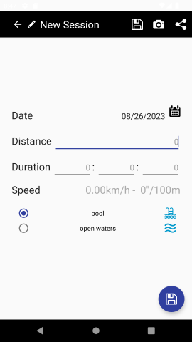
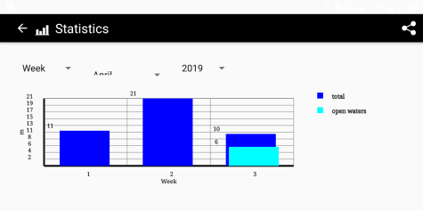

# nadamillas

## An aplication to count your swimming workouts

### Introduction

This is an Android App that manages your workouts on the water. You can take into account whether it was an open water session or at the pool, browse your swimming session in this and previous months and sequentially explore the history. The application generates graphs for week, month and year measurements.

*Esta es una aplicación para Android que gestiona tus entrenamientos en el agua. Puedes tomar en cuenta si fue una sesión de aguas abiertas o en la piscina, hojear las sesiones en los meses anteriores y explorar secuencialmente el histórico de entrenamientos. La aplicación genera gráficos para resultados de metros por semana, mes y año.*

### Languages

Nadamillas is available in English and Spanish. It can also be chosen to select between meters (kilometers), and yards (miles).

*Nadamillas está disponible en español e inglés. También se puede seleccionar el uso de metros (kilómetros) y yardas (millas).*

### Creating a new session

A new session is just created by tapping the '+' button in the main screen. The data required is the meters swam, and where there were swam. Optionally, mainly for open water sessions, you can introduce the time it took you to swim that distance, so the app can calculate the mean pace, in km/h and also seconds per one hundred meters.

*Un nuevo entrenamiento se registra simplemente pulsando sobre el botón '+' en la pantalla principal. Los únicos datos requeridos es la distancia nadada, y si fue en piscina o en aguas abiertas. Opcionalmente, sobre todo para aguas abiertas, se puede introducir también el tiempo que se empleó en nadar, de manera que la app pueda calcular el ritmo medio, en km/h y en segundos por cien metros.*

### Browsing sesions

A calendar is shown in which each day with a training session sports a dot. A blue dot means a session at the pool, while a green one means an open waters session. The calendar can be swiped to the left or to the right to get to the previous and following month, respectly. In the lowermost part of the screen all trainings for the selected day are shown.

*Se utiliza un calendario para mostrar cada día con entrenamientos, mediante un punto. El punto azul se emplea para indicar entrenamientos en piscina, mientras que un punto verde denota entrenamientos en aguas abiertas. El calendario se puede arrastrar a izquierda y derecha para navegar a meses previos y posteriores, respectivamente. En la parte baja de la pantalla aparecen los entrenamientos para el día seleccionado.*

### Data graphs

A graph is automatically and immediately drawn given the data stored in the app. In the uppermost part of the screen you can choose between weekly, monthly and yearly graphs, which are updated immediately. It will also redrawn if the device's orientation is changed. You can also zoom in and out from the graph.

*Un gráfico resumiendo los datos almacenados en la app se muestra automáticamente. En la parte superior de la pantalla se puede escoger entre mostrar los datos por semana, mes o año. El gráfico se actualizará automaticamente, incluso cuando el dispositivo se coloque en horizontal. También es posible hacer zoom, agrandando o empequeñeciendo el mismo.*

### Share

All screens showing data have the "share" button, allowing you to capture a screenshot of that screen and share it to whatsapp, email, or any other application installed.

*Todos las pantallas que muestran datos tienen un botón para compartir, permitiendo la captura de la pantalla y su envío por whatsapp, email, o cualquier otra aplicación instalada.*

